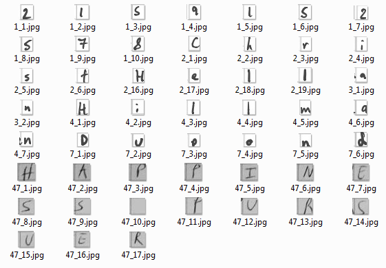

# ICR detection in filled form
The goal is to automatically detect paper-based form fields.

**This project is not finished yet. This is a proof of concept.**

Here is a simple example with its output.
But, keep in mind, in the real world, there is noise, missing parts and imperfection.

    

Hopefully one day, the code will be able to highlight where are the handwritten characters with a great accuracy.

I focus only on paper-based forms. Because handwriting text represents valuable data. They can help automatically detect entities involved.
Printed characters can be processed by tesseract 4.

# Results

## Paper-based form (Jan 5, 2018)
It can highlight most boxes.
It's a great start. Some work need to be done to improve accuracy.
We can see boxes, but I need to find a way to isolate each characters (and manage overlapping characters on 2 boxes)

    

## Paper-based form (Jan 9, 2018)
We know where are those boxes. If the page is too complex, we stop processing to prevent spending too much time and/or using resource (CPU).

Some extra processing need to be done to evaluate if those boxes seem valid. (For example, most boxes should have the same width and height)

For now, we know some position: top left, top right, bottom left and bottom right.

The example below shows boxes corners and centers.

    

## Characters extraction (Jan 10, 2018)
It validates that most boxes has the same width and height.

Some fine tuning has been done to support more paper-based forms.

The image below shows some characters.

    

# Copyright and license
Code released under the MIT license.
