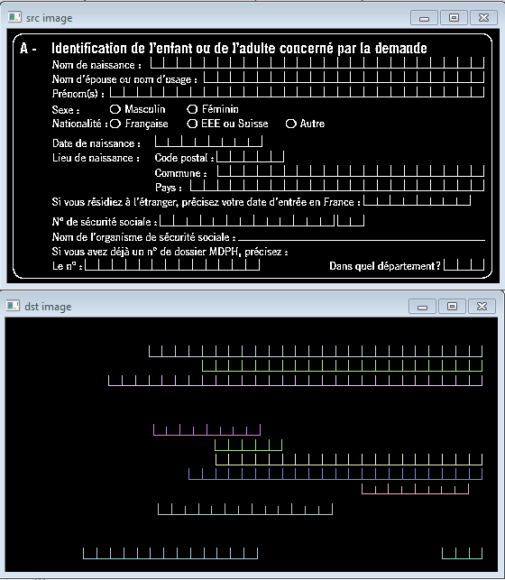

# ICR detection in filled form
The goal is to automatically detect paper-based form fields.

**This project is not finished yet. This is a proof of concept.**

Here is a simple example with its output.
But, keep in mind, in the real world, there is noise, missing parts and imperfection.

    

Hopefully one day, the code will be able to highlight where are the handwritten characters with a great accuracy.

I focus only on paper-based forms. Because handwriting text represents valuable data. They can help automatically detect entities involved.
Printed characters can be processed by tesseract 4.

# Copyright and license
Code released under the MIT license.
